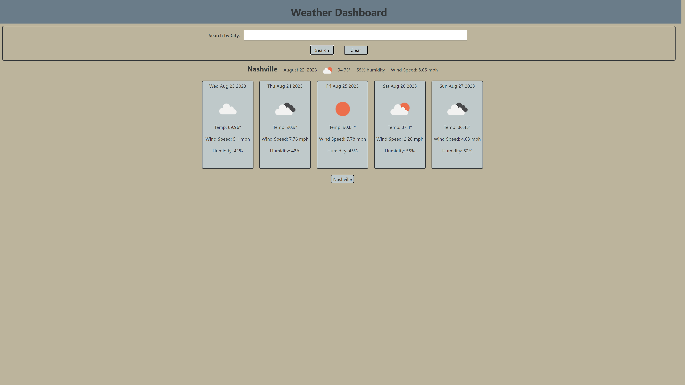

# Weather App

## Description

This weather app will allow the user to search for any city and return the current conditions as well as a 5-day forecast. Each search is saved to a button at the bottom of the page so it can be quickly revsited. There is a clear button as well to allow users to clear the page.

This app requires the use of two weather APIs, one for the current conditions and one for the forecast which required iteration to select the correct elements for the page.

## Screenshot and Live URL

[https://erinhamrick.github.io/WeatherApp/]

## Sources
APIs used: 

Current conditions: https://api.openweathermap.org/data/2.5/weather?lat={lat}&lon={lon}&appid={API key}

Forecast: https://pro.openweathermap.org/data/2.5/forecast/climate?lat={lat}&lon={lon}&appid={API key}

## License
Copyright (c) 2023 Erin Hamrick

Permission is hereby granted, free of charge, to any person obtaining a copy of this software and associated documentation files (the "Software"), to deal in the Software without restriction, including without limitation the rights
to use, copy, modify, merge, publish, distribute, sublicense, and/or sell
copies of the Software, and to permit persons to whom the Software is
furnished to do so, subject to the following conditions:

The above copyright notice and this permission notice shall be included in all copies or substantial portions of the Software.

THE SOFTWARE IS PROVIDED "AS IS", WITHOUT WARRANTY OF ANY KIND, EXPRESS OR IMPLIED, INCLUDING BUT NOT LIMITED TO THE WARRANTIES OF MERCHANTABILITY, FITNESS FOR A PARTICULAR PURPOSE AND NONINFRINGEMENT. IN NO EVENT SHALL THE AUTHORS OR COPYRIGHT HOLDERS BE LIABLE FOR ANY CLAIM, DAMAGES OR OTHER LIABILITY, WHETHER IN AN ACTION OF CONTRACT, TORT OR OTHERWISE, ARISING FROM, OUT OF OR IN CONNECTION WITH THE SOFTWARE OR THE USE OR OTHER DEALINGS IN THE
SOFTWARE.